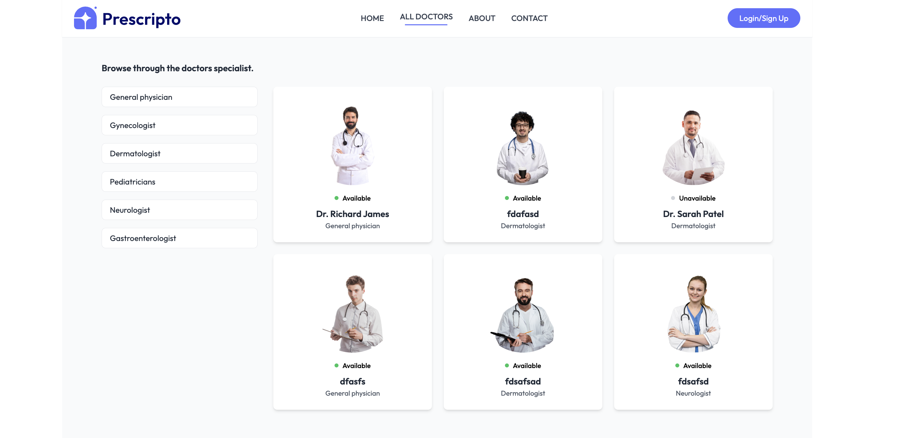
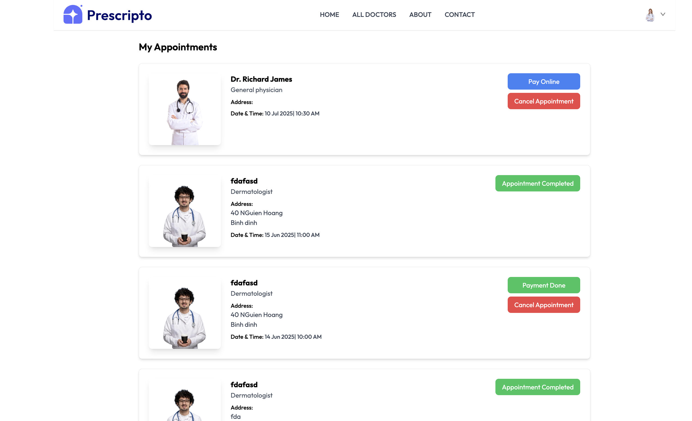
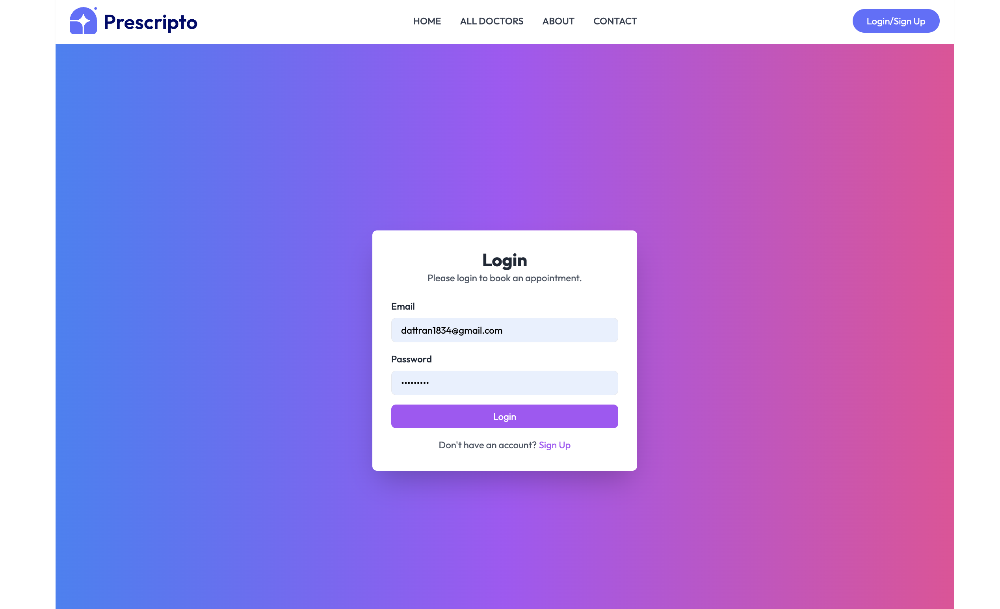
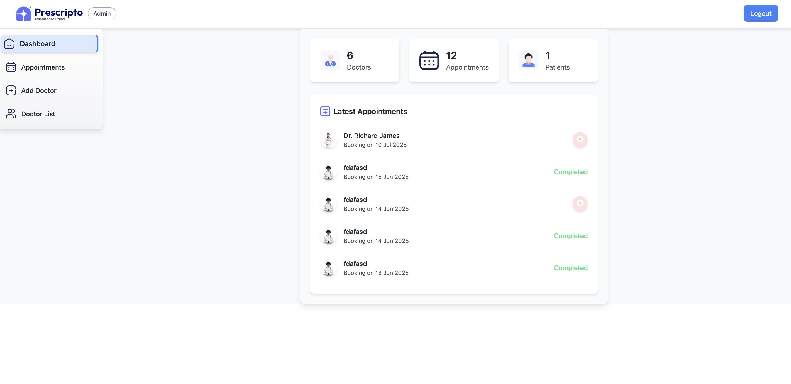
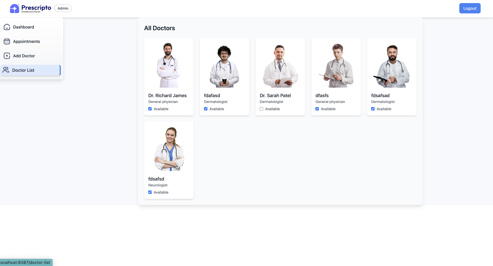
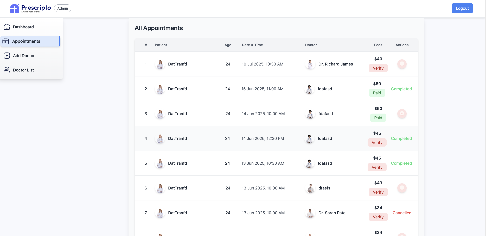
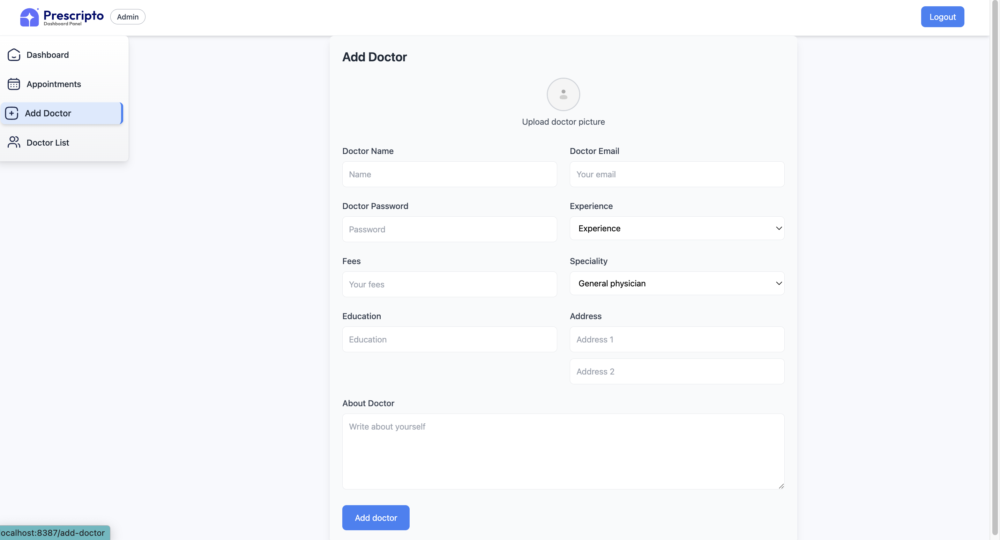
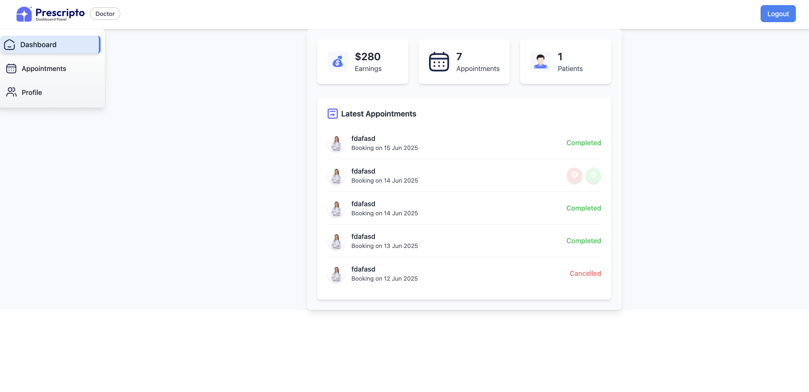
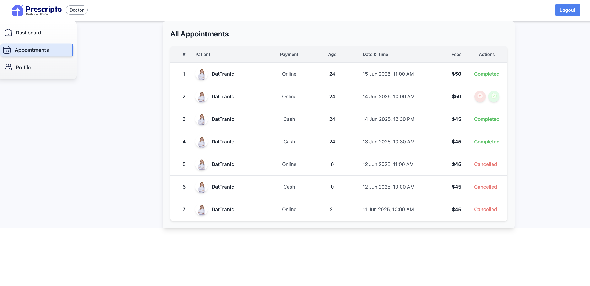
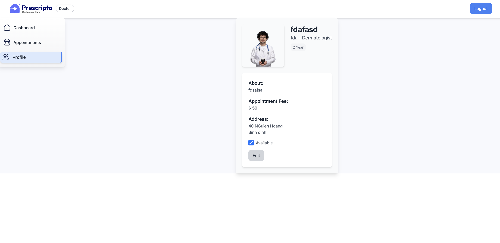

# 🍔 Booking Doctor Appointment (Full Stack)

This is a complete **Full Stack Booking Doctor Appointment Website** built with **React JS**, **MongoDB**, **Express**, **Node.js**, and **Stripe**. It includes:

- 🌐 A user-facing **Frontend Website**
- ⚙️ An **Admin Panel** for managing the platform
- 🛠️ A **Backend Server** for handling APIs and database communication
- 💳 Integrated **Stripe** payment gateway
- 🔐 Full **Authentication System** with user registration & login

### 🏠 Frontend (User Interface)

#### Homepage

*Browse available doctors and specialties*

#### Doctor List

*View all doctors with their specialties and availability*

#### My Appointments

*User can view and manage their appointments*

#### Login

*Secure Stripe payment integration*

### 🔐 Admin Panel

#### Admin Dashboard

*Overview of appointments, doctors, and earnings*

#### Manage Doctors

*Add, edit, and manage doctor profiles*

#### All Appointments

*View and manage all user appointments*

#### Add New Doctor

*Form to add new doctors to the platform*

### 👨‍⚕️ Doctor Panel

#### Doctor Dashboard

*Doctor's personal dashboard with appointment overview*

#### Doctor Appointments

*Manage appointments and patient information*

#### Doctor Profile Management

*Doctors can update their profile and availability*

---

## 📌 Features

- User signup/login and JWT-based authentication
- Secure Stripe payment integration
- Easy booking for customers with detailed doctor information, specialties and pricing
- Admin dashboard for managing appointments, doctors, and earnings
- Doctor dashboard for managing appointments, availability and earnings
- Real-time booking status updates
- Mobile responsive design
- Search and filter doctors by specialty
- Email notifications for appointments
- Appointment cancellation and rescheduling

---

## 🛠 Technologies Used

### 📦 Backend
- **Node.js** + **Express.js**
- **MongoDB** + **Mongoose**
- **JWT** for authentication
- **Stripe** API for payments
- **Multer** for file uploads
- **Nodemailer** for email notifications

### 🎨 Frontend (User & Admin)
- **React.js**
- **React Router**
- **Vite** for faster development
- **Axios** for API communication
- **Tailwind CSS** for styling
- **React Context** for state management
- **React Toastify** for notifications
- **Cloudinary** for image storage

---

## 🚀 Getting Started

### 1️⃣ Clone the Repository
```bash
git clone https://github.com/DatTran0509/Booking_Doctor.git
cd Booking_Doctor
```

### 2️⃣ Setup Environment Variables

Create a `.env` file in the `backend`:

```env
# backend/.env
PORT=4000
MONGO_URI=your_mongodb_uri
JWT_SECRET=your_jwt_secret
STRIPE_SECRET_KEY=your_stripe_secret_key
CLOUDINARY_NAME= your_cloudinary_name
CLOUDINARY_API_KEY= ...
CLOUDINARY_API_SECRET= ...
ADMIN_EMAIL = 'admin@prescripto.com'

```


---

### 3️⃣ Run with Docker (Recommended)

#### 🐳 Build & Run All Services
```bash
docker-compose up --build
```

Wait for the containers to finish building and you can access:

| Service   | URL                       |
|-----------|---------------------------|
| Backend   | http://localhost:4000     |
| Frontend  | http://localhost:8386     |
| Admin     | http://localhost:8387     |

---

### 4️⃣ Run Manually (Dev Mode)

#### ▶️ Backend
```bash
cd backend
npm install
npm run dev
```

#### ▶️ Frontend
```bash
cd frontend
npm install
npm run dev
# Default port: http://localhost:5173
```

#### ▶️ Admin
```bash
cd admin
npm install
npm run dev
# Default port: http://localhost:5173 (change if conflict)
```

---

## 🌐 Explore the App

| Role       | URL                    | Description              |
|------------|------------------------|--------------------------|
| 👥 User     | http://localhost:8386  | Browse & order food      |
| 🔐 Admin    | http://localhost:8387  | Manage orders/products   |
| ⚙️ API      | http://localhost:4000  | Backend API endpoints    |

---

## 📝 License

This project is for educational and learning purposes. You may use it as a base for your own full stack app.

---

## 🙌 Author

Created with 💖 by [DatTran]. Thank you for your support: GreatStack
